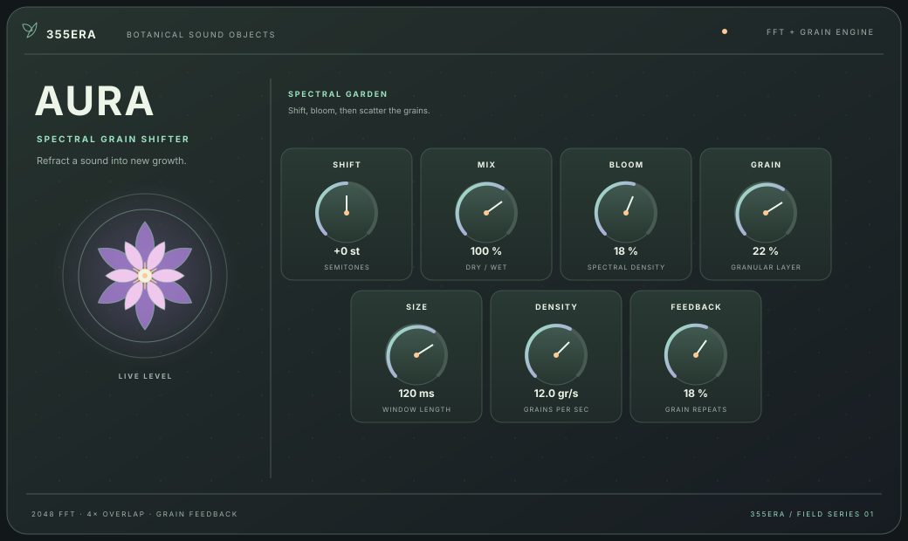

# Aura

**Aura** is a stereo/mono VST3 FFT spectral shifter by **355ERA**. It is designed as an insert effect for samples, field recordings, and instruments, with a soft botanical look suited to organic and botanica sound design.



## Controls

- **Shift** — continuously translates spectral frequencies by −1500 to +1500 Hz in 0.1 Hz steps. This is a frequency-domain offset, not semitone transposition. Double-click the knob to return to zero.
- **Mix** — blends the latency-matched dry signal with the shifted signal.
- **Bloom** — diffuses energy across neighboring spectral bins for a denser, softer tone.
- **Grain** — blends in a granular delay layer after the spectral processor.
- **Size** — sets grain length from 25 to 240 ms.
- **Density** — sets the grain trigger rate from 2 to 24 grains per second.
- **Feedback** — feeds grain output back into the delay buffer. Feedback is bounded and softly saturated.

The processor uses a custom 2048-point radix-2 FFT and 4× overlap-add to form an analytic signal, then applies a phase-continuous frequency offset in Hz. A Nyquist guard removes content that would alias when shifting upward. Shift and blend controls are smoothed to avoid abrupt automation steps. The grain engine uses eight preallocated Hann-windowed playback voices per channel, interpolated reads, and a two-second circular buffer. Feedback saturation is confined to the feedback signal, so it does not saturate the incoming sample. Its audio buffers are allocated before playback, so processing does not allocate memory on the audio thread. The plugin reports its 2048-sample FFT latency to the host and a two-second tail for the granular feedback. Controls are automatable and saved in the DAW project. The lily visualizer responds to input level.

The editor keeps its existing layout and can be resized proportionally from 780 × 465 to 1560 × 930, so the darker, Portal-inspired charcoal, orchid, and mint treatment, lily visualizer, labels, and controls scale together in hosts such as Ableton Live. Artwork uses vector paths and text instead of stretched bitmap UI, keeping edges and lettering clear at different sizes.

## Build on Windows

Install Visual Studio 2022 (Desktop development with C++), CMake 3.22 or newer, and Git. From this folder run:

```powershell
cmake -S . -B build -A x64
cmake --build build --config Release --target Aura_VST3
```

The VST3 bundle is created under `build/Aura_artefacts/Release/VST3/Aura.vst3`. Copy it to your DAW's VST3 folder or configure CMake to install it after building. The macOS GitHub Actions artifact is built for Intel (x86_64); Apple Silicon users can run an Intel build of their DAW under Rosetta to load it.

To launch the optional standalone build, build `Aura_Standalone` instead. It provides a convenient way to audition the effect outside a DAW.

## Build on macOS or Linux

Use a C++17 compiler, CMake 3.22 or newer, and Git. On Ubuntu, install the build and GUI/audio development packages used by CI:

```sh
sudo apt-get update
sudo apt-get install -y build-essential libasound2-dev libfreetype6-dev \
  libfontconfig1-dev libx11-dev libxcomposite-dev libxcursor-dev libxext-dev \
  libxinerama-dev libxrandr-dev libxrender-dev libxi-dev libgl1-mesa-dev
```

Then build with:

```sh
cmake -S . -B build -DCMAKE_BUILD_TYPE=Release
cmake --build build --config Release --target Aura_VST3
```

CMake downloads the pinned JUCE 9.0.3 source on the first configure, so the first build needs network access. A GitHub Actions workflow is included to build the VST3 target on Windows, macOS Intel, and Linux, then attach each platform's VST3 bundle to the workflow run as a downloadable artifact. Aura does not bundle sample libraries; a VST3 bundle around a few megabytes is normal for a vector interface and native DSP, and file size does not measure audio quality.

## Add to GitHub

This project folder is already a Git repository on branch `main` with an initial commit. Create an empty repository on GitHub, then connect and push it:

```sh
git remote add origin https://github.com/YOUR-ACCOUNT/Aura.git
git push -u origin main
```

Replace `YOUR-ACCOUNT` with your GitHub username or organization. The workflow builds the plugin after pushes and pull requests and uploads each platform's VST3 bundle as a run artifact; it does not publish a release or install binaries.

If you start from the source ZIP instead, initialize Git and create the first commit before adding the remote:

```sh
git init --initial-branch=main
git add .
git commit -m "Add Aura VST3 spectral shifter"
git remote add origin https://github.com/YOUR-ACCOUNT/Aura.git
git push -u origin main
```

## Notes

- Aura processes incoming audio; it is an effect plugin, not a sample browser or sampler. Load it on an audio track or sample channel in your DAW.
- JUCE is fetched from its official repository at the pinned `9.0.3` tag. Review JUCE's licensing terms before distributing builds.
- The four-character VST3 manufacturer and plugin IDs in `CMakeLists.txt` should stay fixed after users have saved projects with Aura.
